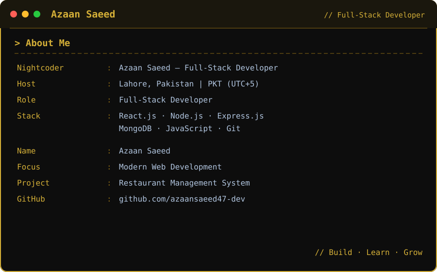

 

### Building Modern Web Experiences with Code & Creativity ⚡

  
  

---

## 👨‍💻 About Me

I'm **Azaan Saeed**, a Full-Stack Developer from Lahore, Pakistan.

I enjoy building modern, responsive and user-friendly web applications using React.js, Node.js and MongoDB.

- 💻 Full-Stack Developer
- ⚛️ React.js enthusiast
- 🚀 Building real-world projects
- 📚 Continuously learning and improving

---

## 🛠️ Tech Stack

---

## 📊 GitHub Stats

 

---

## 🚀 Featured Projects

### 🍽️ Restaurant Management System

A full-stack restaurant management application designed to simplify restaurant operations.

**Features:**

- Table Management
- Menu Management
- Food Ordering
- Kitchen Operations
- Billing
- Inventory Management
- Staff Management
- Authentication

**Tech Stack:** React.js · Node.js · Express.js · MongoDB

---

### ⚛️ Other React Projects

A collection of modern React applications focused on responsive design, reusable components and smooth user experiences.

**Highlights:**

- Modern UI
- Responsive Design
- API Integration
- Reusable Components
- Animations

**Tech Stack:** React.js · JavaScript · CSS

---

## 🌱 Currently Learning

- Advanced React.js
- Node.js & Express.js
- Database Architecture
- Full-Stack Development
- Modern Web Technologies

---

## 🌐 Connect With Me

---

### ⚡ Code • Create • Learn • Grow

